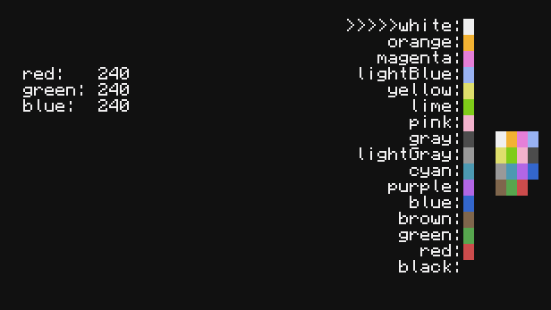

# Color Switcher for CC:Tweaked


Color Switcher (ColSw) is a program for CC:Tweaked for quickly editing your current palette.

Usage:
```
colsw apply [PATH]; applies the palette from the file and quits.
colsw [PATH]; opens existing palette file (or creates a new one)
colsw --help; prints out a helpful message.
```

ColSw uses a very simple file structure where a palette can be stored like this:
```
r, g, b
r, g, b
r, g, b
r, g, b
...
```
(Although technically this one is also valid):
```
r g b
r g b
r g b
r g b
...
```
(And I guess this one too?? It ain't strict, alright?):
```
|r|g|b|
|r|g|b|
|r|g|b|
|r|g|b|
...
```
Basically it just requires 16 lines of 3 integers ranging from 0 to 255.